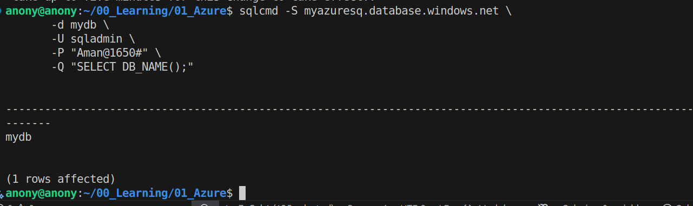

# Week 5
To connect to a db server
```
sqlcmd -S myazuresq.database.windows.net \
       -d mydb \
       -U sqladmin \
       -P "Password" \
       -Q "SELECT DB_NAME();"
```

Connection Proof


Steps
1. Create Azure SQL logical server
2. Create Azure DB
3. Add IP in firewall to allow connection
4. Now use sqlcmd to check connectivity
