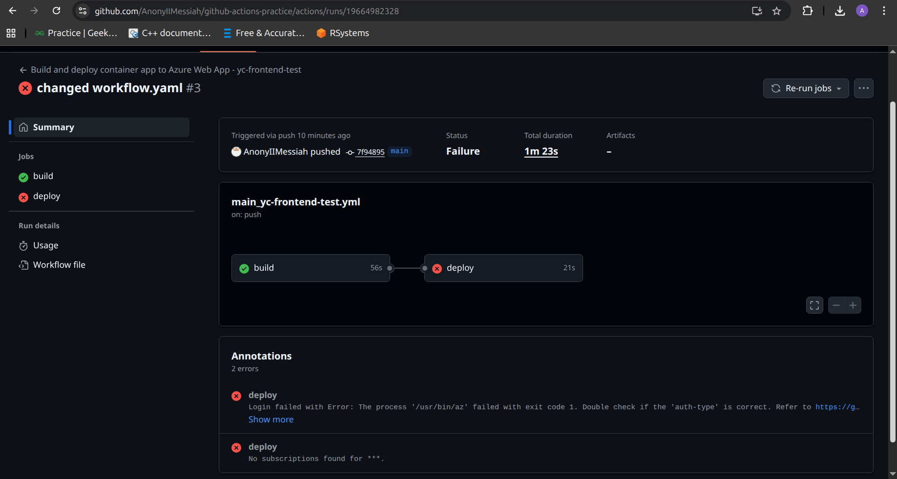

# Week 7

Web-app Github Link: https://github.com/AnonyIIMessiah/github-actions-practice 

Official Docs for login with UAMI

Dont had access to create Service Principle required for CICD
```
{"sessionId":"c38b303e631b4e8083d1ea35f13e9130","subscriptionId":"","resourceGroup":"","errorCode":"401","resourceName":"","details":"No access"}
```

Command to create Service Principle
```
az ad sp create-for-rbac --name my-cicd-sp --role contributor --scopes /subscriptions/<sub id>/resourceGroups/<RG> --output json
```


### Pipeline:


### Note: I have tried to use managed identity to use with github actions, but I didnt had the access for role assignment on both Resource level and Subscription level, so it was failing in deployment phase
