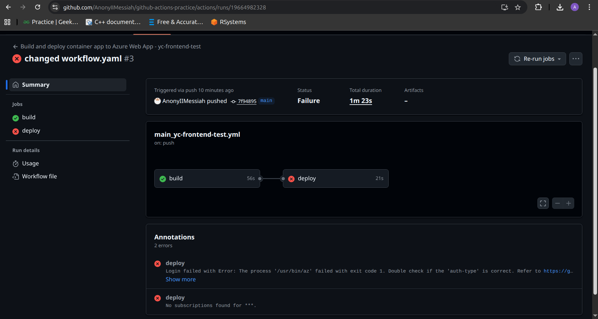

# Week 7

Web-app Github Link: https://github.com/AnonyIIMessiah/github-actions-practice 

Official Docs for login with UAMI

Dont had access to create Service Principle required for CICD
```
{"sessionId":"c38b303e631b4e8083d1ea35f13e9130","subscriptionId":"","resourceGroup":"","errorCode":"401","resourceName":"","details":"No access"}
```

Command to create Service Principle
```
az ad sp create-for-rbac --name my-cicd-sp --role contributor --scopes /subscriptions/<sub id>/resourceGroups/<RG> --output json
```
Error:
```
(AuthorizationFailed) The client 'Aman.Verma@rsystems.com' with object id 'c355befe-f05c-4615-9e16-a4cd11f0edae' does not have authorization to perform action 'Microsoft.Authorization/roleAssignments/write' over scope '/subscriptions/ac6e8c49-833e-427d-bcc4-87042af5ddaf/resourceGroups/yc-basics-rg-12345/providers/Microsoft.Authorization/roleAssignments/5a68b9fc-46b7-497f-b2d1-cf115867fbb9' or the scope is invalid. If access was recently granted, please refresh your credentials.
Code: AuthorizationFailed
Message: The client 'Aman.Verma@rsystems.com' with object id 'c355befe-f05c-4615-9e16-a4cd11f0edae' does not have authorization to perform action 'Microsoft.Authorization/roleAssignments/write' over scope '/subscriptions/ac6e8c49-833e-427d-bcc4-87042af5ddaf/resourceGroups/yc-basics-rg-12345/providers/Microsoft.Authorization/roleAssignments/5a68b9fc-46b7-497f-b2d1-cf115867fbb9' or the scope is invalid. If access was recently granted, please refresh your credentials.
```

### Pipeline:


### Note: I have tried to use managed identity to use with github actions, but I didnt had the access for role assignment on both Resource level and Subscription level, so it was failing in deployment phase
