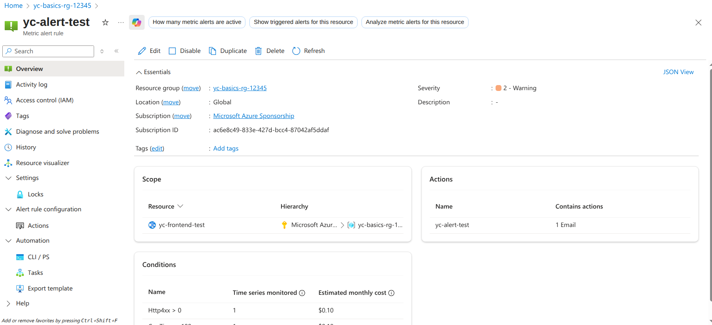

# Week 8

## 
| Feature | What it does | Real-world use case | Cost (approx) |
|----------|------------|------------|-----------|
| Log Analytics Workspace | Central brain for all logs + KQL queries | “What broke at 3 AM?” | ~$2.50/GB |
| Application Insights | "App-level telemetry (requests |  failures |  traces)" | “Why is my API slow?” | Free tier + $2.30/GB |
| VM / App Service Diagnostics | Sends OS + platform logs to Log Analytics | “Is my VM out of memory?” | Free |
| Alert Rule | Fires when condition met → email/SMS/Action Group | “Wake me up if CPU > 80 %” | Free |
| Budget + Alert | Screams when you’re about to burn money | “Stop me before I spend $100 this month” | Free |

## Alert
Screenshot


## Budget
Not able to create budgets, as getting following error:
```
Sponsorship subscriptions are not available in Cost Management today. Please use the Sponsorship portal
```
```
Cost Management budgets is not supported for this account. Please change to another scope.
```